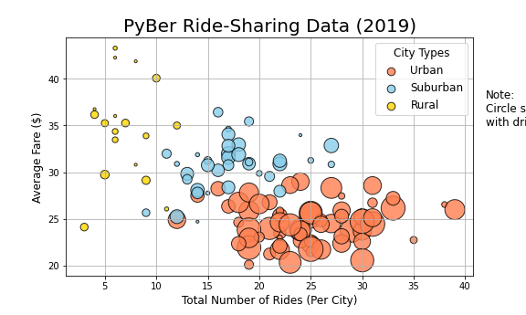
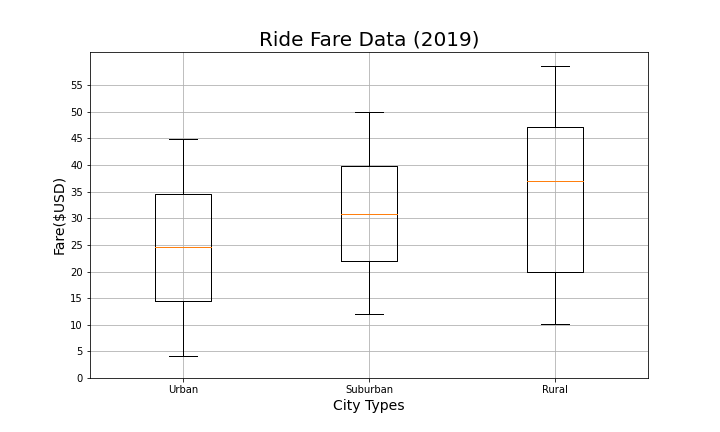
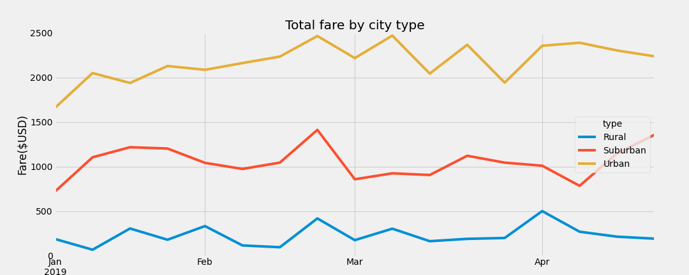

# PyBer_-Analysis
## Project Overview
The project is helping Pyber to organize the data and create the visulaizes to analysis the relationship between riders and drivers in different cities.
*Organize data steps:
1. Import your data into a Pandas DataFrame.
2. Merge your DataFrames.
*Visulaize data steps:
1. Create a bubble chart that showcases the average fare versus the total number of rides with bubble size based on the total number of drivers for each city type, including urban, suburban, and rural.
2. Determine the mean, median, and mode for the following:
The total number of rides for each city type.
The average fares for each city type.
The total number of drivers for each city type.
3. Create box-and-whisker plots that visualize each of the following to determine if there are any outliers:
The number of rides for each city type.
The fares for each city type.
The number of drivers for each city type.
4. Create a pie chart that visualizes each of the following data for each city type:
The percent of total fares.
The percent of total rides.
The percent of total drivers.

## Resources
Data Resource: city_data.csv and ride_data.csv

Software: Pandas liabaries, Matplotlib in Jupyter Notebook

## Results
We can feel from the bubble's picture that urban has the most riders and drivers and the lowest cost per ride, while rural has the least riders and drivers and the highest cost per ride.

However, the clear results we need to check the summaries.

Urban has highest amount of ride.

Rural has highest average fare per ride.

Urban has most drivers.

The chart of summary shows that urban has low cost of per ride, but total fares of ride is high. On the opposite side, rural has low total fares of rides, but high cost of per ride.

## Summary

Based on the results, provide three business recommendations for addressing any disparities among the city types:

1. Provide better benefits for rural drivers and strive for more drivers to serve

2. Subsidies for 'fringe' drivers in urban and suburban to encourage them to cross borders and go to the next level of city service.

3. Provide some discounts and subsidies for rural rides, and strive for more riders to consume
 
